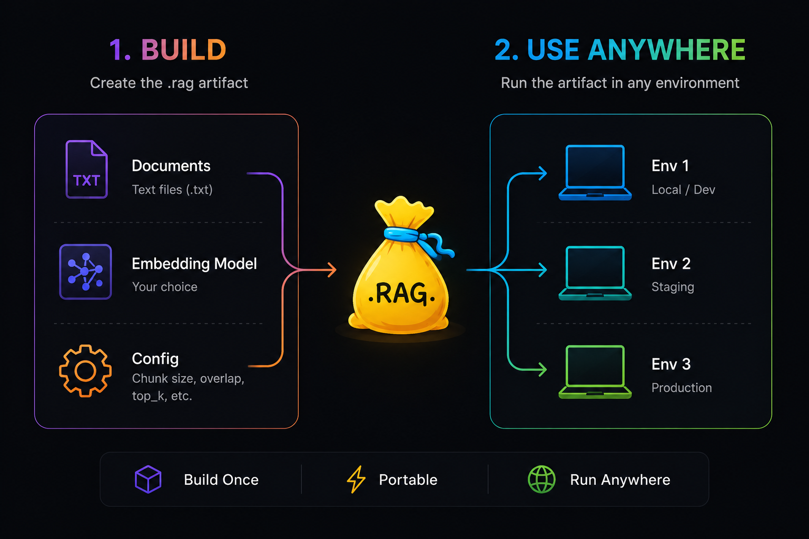
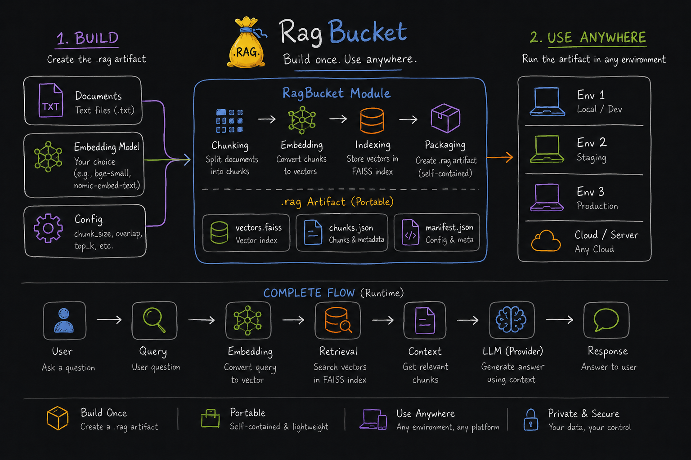

<div align="center">


# RagBucket

### Portable Executable RAG Artifacts for Python

**Build once. Load anywhere.**

[](https://pypi.org/project/ragbucket/)
[](https://pypi.org/project/ragbucket/)
[](LICENSE)
[](https://pypi.org/project/ragbucket/)

<p>
  <a href="#-installation">Installation</a> •
  <a href="#-quickstart">Quickstart</a> •
  <a href="#-what-is-ragbucket">What is RagBucket?</a> •
  <a href="#-multi-provider-runtime">Providers</a> •
  <a href="#-roadmap">Roadmap</a>
</p>

</div>

---

## The Problem

Traditional ML models are portable by default:

```
model.pt   model.onnx   model.gguf   model.h5
```

They can be saved, shared, and deployed anywhere. **RAG systems can't.**

A typical RAG pipeline is a fragile web of:

- vector databases tied to infrastructure
- embedding pipelines that must be re-run
- chunking configs scattered across codebases
- provider-specific integrations with no portability
- metadata that lives nowhere and everywhere

**RagBucket solves this.** It packages your entire RAG pipeline — vectors, chunks, config, and runtime metadata — into a single portable `.rag` artifact.

---

## Introducing `.rag`

<div align="center">

</div>

A `.rag` artifact is a **self-contained, executable unit of retrieval intelligence**. It packages:

| What                    | How                         |
| ----------------------- | --------------------------- |
| Semantic embeddings     | via Sentence Transformers   |
| Vector index            | via FAISS                   |
| Chunked knowledge       | via LangChain splitters     |
| Retrieval configuration | embedded in manifest        |
| Runtime metadata        | versioned artifact manifest |

**Build it once. Drop it anywhere. Query it with one line of code.**

---

## Full Architecture

<div align="center">

</div>

---

## ✦ Installation

```bash
# Using uv (recommended)
uv add ragbucket

# Using pip
pip install ragbucket
```

---

## ⚡ Quickstart

### Step 1 — Build a `.rag` Artifact

```python
from ragbucket import RagBuilder, RagConfig

config = RagConfig(
    embedding_model="BAAI/bge-small-en-v1.5",
    chunk_size=512,
    chunk_overlap=50,
    top_k=3
)

builder = RagBuilder(config=config)

builder.build(
    doc_path="docs/",
    op_path="artifacts/demo.rag"
)
```

This generates a single portable file:

```
artifacts/demo.rag
```

That's it. Your entire retrieval system — vectors, chunks, config — is now in one file.

---

### Step 2 — Load and Query Anywhere

```python
from ragbucket import RagRuntime
import os
from dotenv import load_dotenv

load_dotenv()

rag = RagRuntime(
    rag_path="artifacts/demo.rag",
    provider="groq",
    api_key=os.getenv("GROQ_API_KEY"),
    model="llama-3.1-8b-instant",
    system_prompt="You are a helpful assistant. Keep answers short and crisp."
)

response = rag.ask("What are Anik's AI/ML skills?")
print(response)
```

---

## 🔌 Multi-Provider Runtime

RagBucket ships with a unified provider abstraction. Swap LLMs without touching your retrieval logic.

| Provider    | Example Model             |
| ----------- | ------------------------- |
| `groq`      | `llama-3.1-8b-instant`    |
| `openai`    | `gpt-4o-mini`             |
| `gemini`    | `gemini-1.5-flash`        |
| `anthropic` | `claude-3-haiku-20240307` |

```python
# Groq
rag = RagRuntime(rag_path="demo.rag", provider="groq", model="llama-3.1-8b-instant", ...)

# OpenAI
rag = RagRuntime(rag_path="demo.rag", provider="openai", model="gpt-4o-mini", ...)

# Gemini
rag = RagRuntime(rag_path="demo.rag", provider="gemini", model="gemini-1.5-flash", ...)

# Anthropic
rag = RagRuntime(rag_path="demo.rag", provider="anthropic", model="claude-3-haiku-20240307", ...)
```

---

## ⚙️ Dynamic Configuration

Customize every stage of the retrieval pipeline with `RagConfig`:

```python
from ragbucket import RagConfig

config = RagConfig(
    embedding_model="sentence-transformers/all-MiniLM-L6-v2",
    chunk_size=1024,
    chunk_overlap=100,
    top_k=5
)
```

Missing values are automatically filled with sensible defaults.

### Supported Embedding Models

Any [Sentence Transformers](https://www.sbert.net/docs/pretrained_models.html) compatible model works:

```python
"BAAI/bge-small-en-v1.5"           # Fast, great for English
"BAAI/bge-base-en-v1.5"            # Balanced quality/speed
"sentence-transformers/all-MiniLM-L6-v2"   # Lightweight default
"sentence-transformers/all-mpnet-base-v2"  # Higher accuracy
```

---

## 📦 What's Inside a `.rag` File

A `.rag` is a compressed ZIP archive containing exactly three files:

```
demo.rag
├── vectors.faiss     ← FAISS vector index (searchable semantic memory)
├── chunks.json       ← Chunked document text
└── manifest.json     ← Config, versioning, and runtime metadata
```

At inference time, the **only external dependency** is an LLM provider API key.

---

## 🏗️ Project Structure

```
ragbucket/
├── builder/
│   ├── builder.py      ← RagBuilder orchestrator
│   ├── chunker.py      ← LangChain recursive splitter
│   ├── embedder.py     ← Sentence Transformers encoder
│   ├── indexer.py      ← FAISS index builder
│   └── packager.py     ← .rag artifact packaging
├── runtime/
│   ├── runtime.py      ← RagRuntime orchestrator
│   ├── loader.py       ← .rag artifact loader
│   ├── retriever.py    ← Semantic vector retrieval
│   ├── models.py       ← Cached embedding model singleton
│   └── providers/      ← Groq / OpenAI / Gemini / Anthropic
├── schemas/
│   ├── config.py       ← RagConfig Pydantic model
│   └── manifest.py     ← Artifact manifest schema
└── utils/
    ├── file_utils.py   ← Document loading helpers
    └── hashing.py      ← Artifact integrity utilities
```

---

## 🧰 Technology Stack

| Component          | Technology               |
| ------------------ | ------------------------ |
| Embeddings         | Sentence Transformers    |
| Vector Search      | FAISS                    |
| Chunking           | LangChain Text Splitters |
| Artifact Packaging | Python `zipfile`         |
| Config Validation  | Pydantic                 |
| Runtime            | Pure Python              |

---

## ✦ Philosophy

RagBucket treats RAG systems as **portable intelligence artifacts** — not fragile infrastructure pipelines.

This cleanly separates:

- **Retrieval memory** (what you built) → lives in the `.rag` file
- **Language generation** (how you query it) → any provider, any environment

The result: reusable semantic memory that travels with your code.

---

## 📄 License

MIT License — see [LICENSE](LICENSE) for details.

---

<div align="center">

**RagBucket** · Built by [Anik Chand](https://github.com/anikchand461)

_The portable runtime layer for Retrieval-Augmented Generation systems._

</div>
